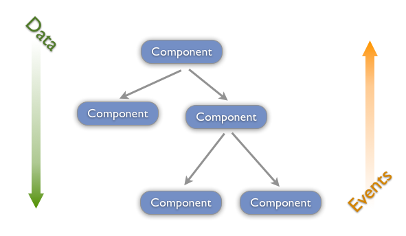

# [译文]context api可以取代redux?

React 16.3 正式推出了 [context api](https://reactjs.org/docs/context.html), 被认为是"redux末日"的官方share data api，究竟真实情况是什么样？到底是不是真的可以取代react社区长期以来依赖的redux组件(redux开发者Mark Ericson表示没这回事！)。下文发表一下个人的看法以及context api正确的使用方式。

## redux和 context api 解决了什么问题？

> “Props down Event up” Uni-direction data flow

用过一段时间React都会知道一个重要的概念：**单向数据流**，React App 遵循数据从上往下单一传递，如果需要子组件需要去改变父组件或者兄弟组件，只能通过event callback或者dispatch action去通知组件改变状态，父组件render之后再通过props把更新值传给子组件完成视图的更新。

当一个state变化影响多个组件更新视图时候，这个state就应该上升存到共有的父组件中，如果只有父子间1~2层之间的传递，那么state与callback通过props传递还是比较好处理的。但是试想一下如果中间还有很多wrapper，间隔着5~6层甚至更多的组件，props还这样一层层传下去的话，很容易造成不可预知的bug，并且让代码难以维护。

要解决上述提及到的这种"Props drilling"问题，通过一个集中的Data Store，把需要共享或更新共同状态的组件用HOC来连接Data Store,这样做我们不但遵从数据单一流动性，并且可以让组件快速获取数据，不用再一层层去传递。

这种架构就是“flux”，与当年的react一同推出。由于FB没有提供官方的组件，只是给了相关概念，一时间涌现了：fluxxor、reflux、redux…，最后redux杀出重围，成为了React社区最推荐的flux实践。


## redux早已经普及了，为什么还要用context api？

我不觉得React推出context api是为了干掉redux，充其量也只能说是补上了一块长期或缺功能，让React不需要依赖第三方flux组件情况下可以解决props drilling这个痛点。但是翻转来说，既然React组件已经有了基础的state/setState,可以做state management结合life cycle，何必还要依赖第三方组件呢？

redux并不是十全十美的，虽然可以通过combineReducers把reducers按模块拆分，可以做separation of concerns，但是因为整个应用实际上还是共享一个单一的Data Store，在state/action命名时候都要小心冲突。

context api是简化版的redux，他没有redux强大生态体系，结合各自中间件例如thunk或saga，做data fetching或处理side effect，不过单单想存一些share data避免props drilling的问题却绰绰有余。

...

## 正确使用姿势

下面会用一个简单的 Counter计数器例子来说明如果使用 context

首先需要新建一个 context.js, 用 React.createContext 实例化一个context，并输出Provider, Consumer

```
import React from 'react'

const ctx = React.createContext()

export const {Provider, Consumer} = ctx

export const withCounter = Component => props => <Consumer>{value => <Component {...props} counter={value} />}</Consumer>

export default ctx
```

发现一个比较好的做法是写一个HOC，类似redux的connect，又或者是react-router中的withRouter。上面例子来说，用withCounter(Foo)包裹，在Foo组件中可以通过props.counter 获得counter object的 state/methods

用HOC好处在于任何需要接上context的组件，只要import withCounter，封装好export就可以，非常省心。

HOC中我们看到context的Consumer包裹了组件，这Consumer有个Code signature 如下：

```
<Consumer>
{value => <Component counter={value} />}
</Consumer>
```

这里类似redux中处理mapStateToProps的过程，value被当作props传入被包裹的组件，key的部分可以任意命名，因为withCounter就是用counter作为key，至于value是从哪里来，下文会有解释。

接下来我们新建一个Counter.js, 这个我们当作Counter顶级父组件，所有Counter相关的state/methods都会存在这个父组件之中。

```
import React from 'react'
import { Provider } from './context'

class Counter extends React.Component {

  constructor (props) {
    super(props)
    this.state = {
      counter: {
        value: 0,
        inc: this.inc,
        dec: this.dec
      }
    }
  }

  inc = () => {
    this.setState(({counter})=>({
      counter: {
      	...counter,
      	value: counter.value+1
      }
    }))
  } 

  dec = () => {
    this.setState(({counter})=>({
      counter: {
      	...counter,
      	value: counter.value-1
      }
    }))
  }
  
  render () {
    return (
      <Provider value={this.state.counter}>
        <CounterCard/>
      </Provider>
    )
  }

}

export default Counter
```

上面代码中，存了一个counter object在state中，包含了计算器当前值value，还有一个递增(inc)和递减(dec)的方法。

```
this.state = { 
  counter: { 
    value: 0,
    inc: this.inc,
    dec: this.dec 
  }
}
```

递增递减部分主要是用setState去更新state.counter.value，至于render function我们会发现context Provider会在这里使用。

```
render () {
  return (
    <Provider value={this.state.counter}>
      <CounterCard/>
    </Provider>    
  )
}
```